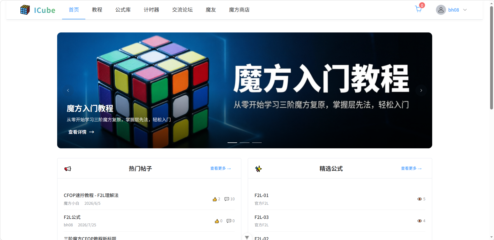
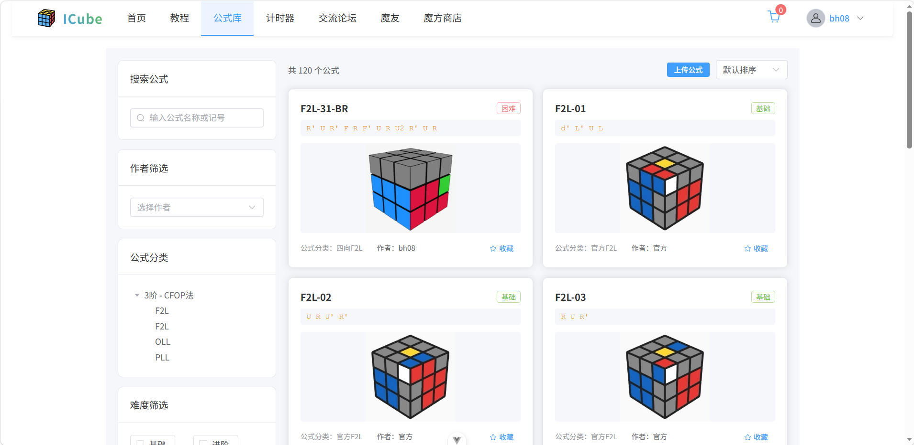
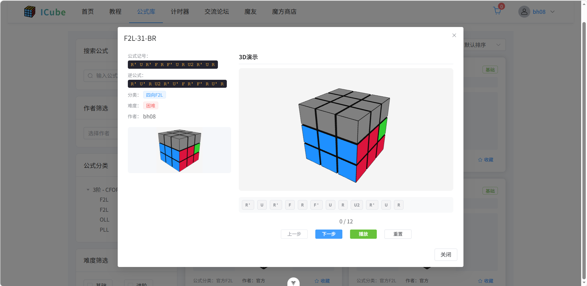
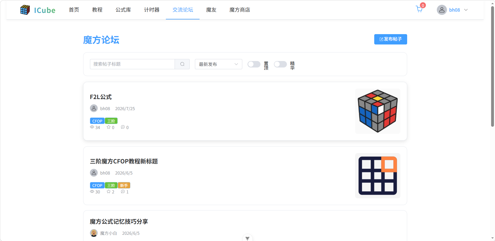
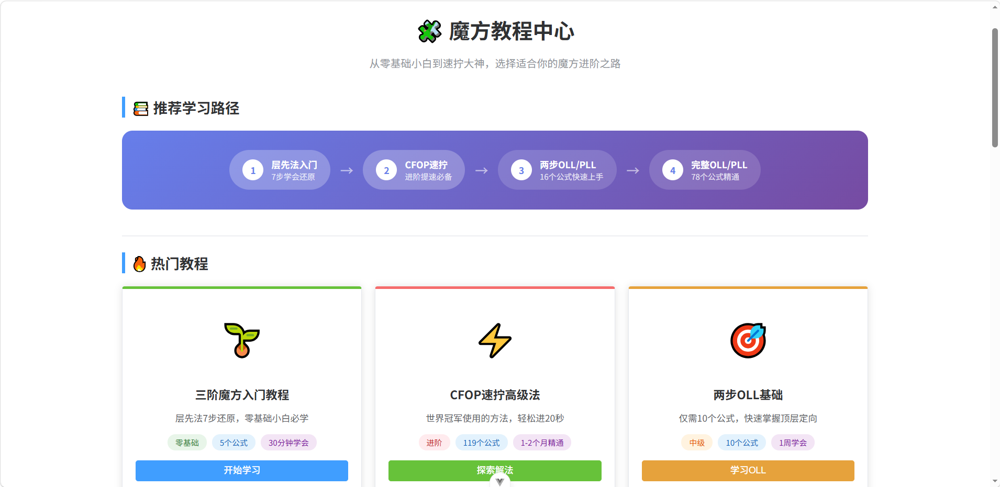
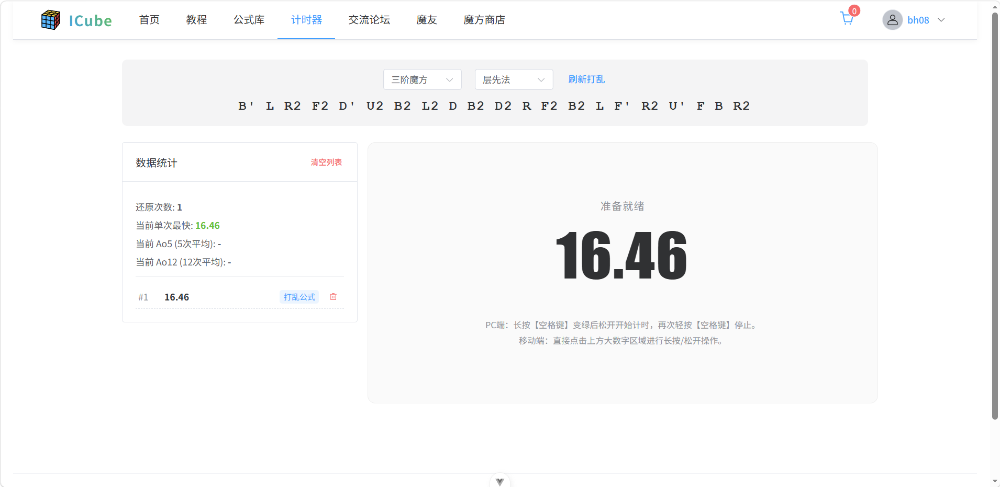
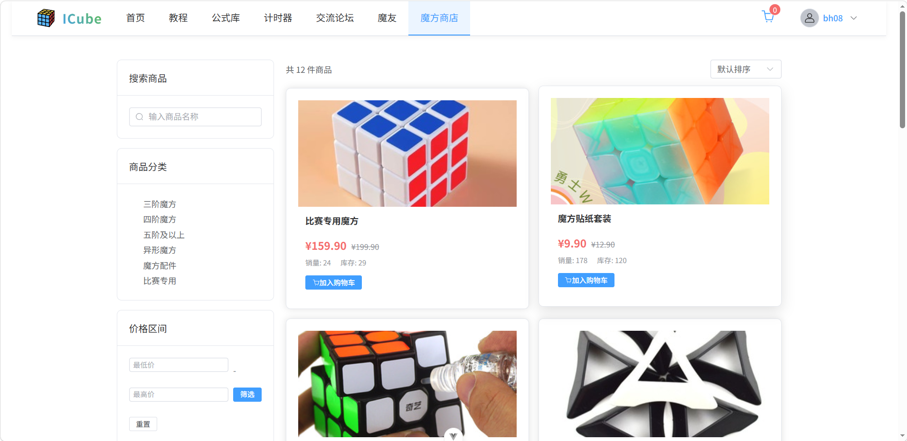
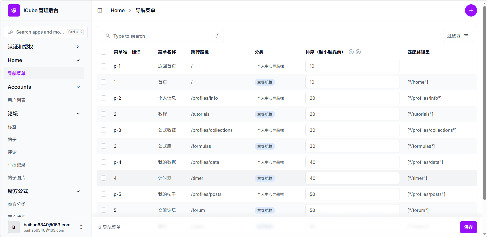

# ICube 魔方学习网站


> 面向魔方爱好者的学习交流平台，提供公式学习、3D 魔方可视化、计时练习、教程学习、社区论坛、商城购物等功能。

---

## 目录

- [项目截图](#项目截图)
- [快速开始](#快速开始)
- [环境要求](#环境要求)
- [技术架构](#技术架构)
- [项目结构](#项目结构)
- [核心功能](#核心功能)
- [技术亮点](#技术亮点)
- [API 接口文档](#api-接口文档)
- [启动方式](#启动方式)
- [数据库配置](#数据库配置)
- [License](#license)
- [联系方式](#联系方式)

---

## 项目截图

| 首页 | 公式库 | 3D 魔方演示 |
|:---:|:---:|:---:|
|  |  |  |

| 论坛 | 教程 | 计时器 |
|:---:|:---:|:---:|
|  |  |  |

| 商城 | 后台管理 |
|:---:|:---:|
|  |  |

---

## 快速开始

### 本地开发（Windows）

```powershell
# 1. 克隆仓库
git clone <仓库地址>
cd ICube

# 2. 首次配置：创建虚拟环境、数据库、Redis、安装依赖、初始化数据
#    详见下方「启动方式 → 方式二：手动启动」第 1-5 步

# 3. 一键启动前后端开发服务器
powershell -ExecutionPolicy Bypass -File .\dev-local.ps1 start

# 4. 关闭服务
powershell -ExecutionPolicy Bypass -File .\dev-local.ps1 stop
```

启动后访问 `http://localhost:5173`（前端），后端 API 运行在 `http://127.0.0.1:8000`。

### 服务器部署（Linux）

```bash
# 1. 克隆仓库到服务器
git clone <仓库地址>
cd ICube

# 2. 配置生产环境变量
cp .env.example .env
# 编辑 .env 填写 ALLOWED_HOSTS、DB_PASSWORD 等

# 3. 一键全量部署
bash deploy.sh full
```

```
.env配置

# ========== 必须修改 ==========
# 允许访问的主机：填你的服务器公网IP或域名，多个用逗号分隔
ALLOWED_HOSTS=公网IP,localhost

# 允许的前端跨域来源：填域名即可，脚本会自动加 http/https 前缀
# 没域名就填公网IP，例如 123.45.67.89
ALLOWED_ORIGIN=公网IP

# 支付宝回调地址（没接支付宝先随便填，后面改）
SERVER_HOST=回调地址

# ========== 可选修改（安全性建议改）==========
# Django 生产环境 SECRET_KEY（改个随机长字符串，至少 32 位）
# 虽然 docker-compose.yml 里没直接引用，但建议在 settings 里加环境变量读取
SECRET_KEY='随机生成的长字符串'

# 数据库密码（和 docker-compose.yml 里的 MYSQL_PASSWORD 保持一致就行，默认不用改）
DB_PASSWORD=icube123
```

---

## 环境要求

| 依赖 | 版本 | 说明 |
|------|------|------|
| Python | 3.13+ | python解释器 |
| Node.js | 18+ | 前端构建环境 |
| MySQL | 8.0 | 主数据库 |
| Redis | 7+ | 缓存、JWT 黑名单、Session |
| Docker | 24+ | 生产环境容器化部署 |
| Docker Compose | v2+ | 多容器编排 |

---

## 技术架构

### 后端 (cube_api)

| 技术栈 | 版本/说明 |
|--------|----------|
| **框架** | Django 6.0 + Django REST Framework |
| **数据库** | MySQL 8.0（开发/生产）+ SQLite（测试） |
| **缓存** | Redis 7 |
| **认证** | JWT (djangorestframework-simplejwt) |
| **API 文档** | drf-spectacular (Swagger/Redoc) |
| **限流** | DRF Throttling |
| **跨域** | django-cors-headers |
| **筛选** | django-filter |
| **图片处理** | Pillow（压缩/裁剪/WebP 转换） |
| **日志** | loguru |

### 前端 (cube_front)

| 技术栈 | 版本/说明 |
|--------|----------|
| **框架** | Vue 3.5 + Vite 8.0 |
| **状态管理** | Pinia 3.0 |
| **路由** | Vue Router 5.0 |
| **UI 组件** | Element Plus 2.14 |
| **3D 渲染** | Three.js 0.184 |
| **HTTP 请求** | Axios 1.16 |
| **富文本编辑** | Quill (@vueup/vue-quill) |

### 移动端 (cube_app)

> 与 `cube_front` 共用同一套 Django 后端 API，UI 框架从 Element Plus 替换为 Vant，3D 魔方演示复用 Three.js。

| 技术栈 | 版本/说明 |
|--------|----------|
| **框架** | Vue 3.5 + Vite 8.0 |
| **UI 组件** | Vant 4.9（自动导入） |
| **跨平台** | Capacitor 8（Android） |
| **3D 渲染** | Three.js 0.184 + @tweenjs/tween.js 25 |
| **状态管理** | Pinia 3.0 |
| **路由** | Vue Router 5.0（Hash 模式） |
| **HTTP 请求** | Axios 1.16 |
| **Markdown** | marked 18 |

---

## 项目结构

### 后端目录结构

```
cube_api/
├── cube_api/                    # Django 项目配置
│   ├── apps/                    # 应用模块
│   │   ├── accounts/            # 用户管理
│   │   │   ├── models.py        # 自定义 User 模型（关注关系、Redis 缓存）
│   │   │   ├── views.py         # 注册、登录、关注、资料管理
│   │   │   ├── authentication.py # CachedJWTAuthentication
│   │   │   ├── services.py      # ProfileCacheService, JWTCacheService
│   │   │   └── throttles.py     # 登录限流
│   │   ├── forum/               # 论坛系统
│   │   │   ├── models.py        # Post, Comment, Tag, Like, Collect, Report, PostImage
│   │   │   ├── views.py         # 帖子 CRUD、点赞、收藏、评论、热门排行、图片上传
│   │   │   ├── services.py      # PostCacheService, HotPostService
│   │   │   ├── serializers.py   # PostImageSerializer、图片 URL 动态生成
│   │   │   └── permissions.py   # IsOwnerOrReadOnly
│   │   ├── home/                # 首页导航
│   │   │   ├── models.py        # NavigationMenu、Banner 轮播图
│   │   │   ├── views.py         # BannerViewSet
│   │   │   ├── serializers.py   # BannerSerializer（图片 URL 动态生成）
│   │   │   ├── admin.py         # BannerAdmin（图片预览、状态 Badge）
│   │   │   └── urls.py          # 轮播图 API 路由
│   │   ├── formula/             # 公式库系统
│   │   │   ├── models.py        # CubeCategory, CubeState, Formula, FormulaTag, FormulaCollection
│   │   │   ├── views.py         # 公式 CRUD、收藏管理、筛选搜索排序、浏览量统计
│   │   │   ├── serializers.py   # 公式序列化器（thumbnail_file/thumbnail_path 双字段）
│   │   │   ├── filters.py       # 公式筛选器（难度多选、作者筛选）
│   │   │   ├── permissions.py   # IsAdminOrReadOnly, IsAdminOrCustomCreator
│   │   │   ├── services.py      # FormulaMatchService（公式匹配）
│   │   │   └── urls.py          # 公式 API 路由
│   │   ├── shop/                # 商城系统
│   │   │   ├── models.py        # Product, Cart, Order, OrderItem
│   │   │   ├── views.py         # 商品 CRUD、购物车、订单管理
│   │   │   ├── serializers.py   # 商城序列化器
│   │   │   ├── alipay_config.py # 支付宝支付配置
│   │   │   └── keys/            # 支付宝密钥文件
│   │   └── timer/               # 计时器模块
│   │       ├── models.py        # TimerRecord
│   │       ├── views.py         # 计时记录 CRUD
│   │       └── serializers.py   # 计时器序列化器
│   ├── utils/                   # 工具类
│   │   ├── common_response.py   # 统一 API 响应格式
│   │   ├── common_exception.py  # 统一异常处理
│   │   ├── common_pagination.py # 统一分页
│   │   ├── image_url.py         # 图片 URL 统一生成
│   │   └── image_processor.py   # 图片处理（压缩、裁剪、WebP、缩略图）
│   └── settings/                # 配置文件
│       ├── dev.py               # 开发环境配置
│       ├── prod.py              # 生产环境配置
│       └── logger_conf.py       # 日志配置
├── media/                       # 媒体文件（头像、公式缩略图、帖子图片）
│   ├── avatars/
│   ├── formulas/
│   └── forum/
├── scripts/                     # 辅助脚本
│   ├── import_formulas.py       # 公式导入
│   ├── regenerate_inverse.py    # 逆公式生成
│   └── update_difficulty.py     # 难度更新
└── manage.py
```

### 前端目录结构

```
cube_front/
├── src/
│   ├── components/              # 组件
│   │   ├── formula/             # 公式相关组件
│   │   │   ├── CubeDemo.vue     # Three.js 3D 魔方动画演示
│   │   │   ├── FormulaLibrary.vue # 公式库卡片列表
│   │   │   └── FormulaEditor.vue # 公式编辑器
│   │   ├── forum/               # 论坛组件
│   │   │   ├── CommentSection.vue
│   │   │   ├── MarkdownEditor.vue
│   │   │   └── TagSelector.vue
│   │   ├── ImageCropper.vue     # 图片裁剪组件（1:1、滚轮缩放、防抖拖拽）
│   │   ├── Header.vue           # 顶部导航栏
│   │   ├── Footer.vue           # 页脚
│   │   └── Main.vue             # 首页主内容
│   ├── views/                   # 页面视图
│   │   ├── HomeView.vue         # 首页布局
│   │   ├── TutorialView.vue     # 教程页
│   │   ├── FormulaView.vue      # 公式页
│   │   ├── TimerView.vue        # 计时器页
│   │   ├── ShopView.vue         # 商城页
│   │   ├── CartView.vue         # 购物车页
│   │   ├── CheckoutView.vue     # 结算页
│   │   ├── PayView.vue          # 支付页
│   │   ├── LoginView.vue        # 登录页
│   │   ├── RegisterView.vue     # 注册页
│   │   ├── forum/               # 论坛页面
│   │   ├── profiles/            # 个人中心
│   │   └── tutorial/            # 教程页面（层先法/CFOP/OLL/PLL）
│   ├── stores/                  # Pinia 状态管理
│   ├── api/                     # API 接口封装
│   ├── http/request.js          # Axios 请求封装（含 401 自动清除登录态）
│   └── router/index.js          # 路由配置
├── public/                      # 静态资源
├── scripts/CubeTest.html        # 3D 魔方测试页面
└── package.json
```

### 移动端目录结构

```
cube_app/
├── src/
│   ├── App.vue                  # 根布局（Tabbar + 触摸滑动切换）
│   ├── main.js                  # 入口（Pinia + Router + StatusBar 配置）
│   ├── api/                     # API 接口封装
│   │   ├── formula.js           # 公式库 API
│   │   ├── forum.js             # 论坛 API
│   │   ├── timer.js             # 计时器 API
│   │   └── user.js              # 用户认证 API
│   ├── components/              # 组件
│   │   ├── common/              # ConfirmDialog.vue（居中卡片式确认弹窗）
│   │   ├── formula/             # CubeDemo.vue（3D 演示）、FormulaCard.vue（含浏览量）
│   │   ├── forum/               # PostCard.vue、CommentSection.vue
│   │   └── timer/               # ScrambleText.vue、TimerDisplay.vue
│   ├── composables/useTabReset.js # 双击导航栏重置筛选
│   ├── http/request.js          # Axios 请求封装（Token 前缀、401 清登录态、错误防抖）
│   ├── router/index.js          # 路由配置（Hash 模式，4 主 Tab + 详情页）
│   ├── stores/user.js           # 用户状态（Pinia + localStorage 持久化）
│   ├── styles/                  # 全局样式
│   │   ├── theme.css           # 主题令牌（颜色/字号/间距/圆角/阴影）
│   │   └── markdown.css        # 公共 Markdown 渲染样式
│   ├── utils/media-url.js       # 媒体 URL 拼接（环境变量驱动）
│   └── views/                   # 页面视图
│       ├── LoginView.vue        # 登录页
│       ├── FormulaView.vue      # 公式列表页（滚动位置恢复 + 浏览量排序）
│       ├── FormulaDetailView.vue # 公式详情页（含 3D 演示 + 删除公式）
│       ├── TimerView.vue        # 计时器页（双 Tab：计时 + 记录 + 下拉刷新）
│       ├── ForumView.vue        # 论坛列表页（四栏 + 收藏 Tab）
│       ├── PostDetailView.vue   # 帖子详情页（Markdown 渲染 + 下拉刷新）
│       ├── PostEditorView.vue   # 帖子编辑器（发表/编辑 + 图片 + 标签）
│       └── ProfileView.vue      # 个人中心页
├── android/                     # Android 原生工程
├── capacitor.config.json        # Capacitor 配置（appId、androidScheme: http）
├── vite.config.js               # Vite 配置（Vant 自动导入、proxy）
├── .env                         # 开发环境变量（baseURL 为空走 proxy）
└── .env.production              # 生产环境变量（后端 IP）
```

### 项目根目录脚本

```
ICube/
├── dev-local.ps1                # 本地开发一键启停脚本（PowerShell，不纳入 Git）
├── deploy.sh                    # 服务器一键部署脚本（Bash）
├── docker-compose.yml           # Docker Compose 编排配置
└── .env                         # 生产环境变量（不纳入 Git）
```

---

## 核心功能

### 1. 用户系统
- 注册/登录：邮箱+密码认证，登录限流保护
- 用户资料：自定义头像、个人简介
- 关注系统：关注/取消关注，Redis 缓存粉丝/关注数量
- JWT 认证：Token 黑名单机制，退出登录即时失效
- 收藏统计：个人中心显示公式收藏数量

### 2. 论坛系统
- 帖子管理：发布、编辑、软删除、置顶、精华标识
- 评论系统：多级回复、点赞、点踩
- 图片上传：多图上传，独立上传接口，自动关联帖子
- 图片预览：帖子列表左右布局，右侧 1:1 比例图片预览
- 图片全量同步：编辑时从 Markdown 解析图片，自动同步数据库关联
- 互动功能：帖子点赞、收藏
- 热门排行：基于点赞、评论、收藏计算热度
- 标签系统：帖子标签分类
- 举报功能：举报帖子和评论

### 3. 魔方公式库
- 公式分类：按阶数、解法（CFOP）、阶段（F2L/OLL/PLL）分类
- 自定义分类：用户创建自定义分类，包含阶数、求解方法、阶段字段
- 分类权限：普通用户可见系统分类 + 自己的自定义分类
- 公式展示：名称、记号、逆公式、缩略图、浏览量
- 难度分级：基础（≤6 步）、进阶（7-11 步）、困难（≥12 步）
- 搜索筛选：按分类、难度、作者三维联合筛选，按名称/记号搜索
- 公式收藏：收藏/取消收藏，个人中心展示收藏列表
- 3D 演示：点击公式卡片查看 3D 动画，支持自动播放公式步骤
- 3D 重置：自动恢复初始视角（相机位置+目标点 Tween 动画）
- 浏览量统计：`view_count` 原子递增（F 表达式）
- 公式跳转：首页精选公式点击后跳转到公式库并打开详情弹窗
- 用户上传公式：自定义上传，所有人可见
- 作者筛选：按作者筛选公式，自动关联当前用户
- 公式编辑器：点击式键盘输入记号，分类/难度选择，图片上传或从公式库选择
- 图片处理：上传自动压缩（>2048px 缩小）、1:1 裁剪、WebP 转换
- 图片裁剪组件：滚轮缩放、防抖拖拽、实时预览
- 自动缩略图：无图片时根据公式名称和记号自动生成
- 目标状态绑定：创建/编辑公式时自动根据分类绑定目标状态
- 权限控制：管理员可编辑所有公式，普通用户仅编辑自己的公式
- 逆公式生成：自动生成逆公式用于 3D 演示回退，修改时同步更新
- 公式删除：用户可删除自己创建的自定义公式

### 4. 教程系统
- 层先法教程：7 个完整步骤
- CFOP 教程：十字、F2L、OLL、PLL 四个阶段
- OLL 基础教程：两步 OLL（3 种棱块定向 + 7 种角块定向，共 10 个算法）
- PLL 基础教程：两步 PLL（2 种角块排列 + 4 种棱块排列，共 6 个算法）
- 完整 OLL 教程：57 个 OLL 算法分组学习
- 完整 PLL 教程：21 个 PLL 算法分组学习
- 学习路径：初学者（16 个算法，1-2 周）→ 进阶（78 个算法，sub-20 秒）
- 教程导航：列表页含学习路径流程图、热门教程卡片、CFOP 进阶分类，页面间互相导航

### 5. 商城系统
- 商品管理：列表、分类、详情
- 购物车：添加、修改数量、删除
- 订单管理：创建（原子扣减库存）、列表、详情
- 支付宝支付：集成支付接口，支持异步回调
- 订单状态：待支付 → 已支付 → 已发货 → 已完成

### 6. 计时器
- 精确毫秒级计时，支持单次和多次计时
- 记录自动保存到数据库
- 成绩统计：平均成绩、最佳成绩

### 7. 3D 魔方可视化
- Three.js 渲染可交互 3D 魔方
- 旋转动画：单层、双层（小写记号）、中间层、整体旋转
- 状态渲染：根据公式目标状态渲染颜色
- 公式播放：自动播放步骤，展示执行过程

### 8. 首页导航
- 动态菜单：数据库读取，支持主导航和个人中心导航
- 精选公式：浏览量最高的公式，点击跳转
- 教程入口：层先法、CFOP 教程卡片
- 轮播图系统：后台动态管理，渐变遮罩、悬停暂停、图片加载占位符

---

## 技术亮点

### 后台管理 (django-unfold)

使用 `django-unfold` 替代原生 Django Admin，提供现代化 Tailwind CSS 风格管理界面。

- **统一继承**：所有 Admin 类继承自 `unfold.admin.ModelAdmin`
- **@display 装饰器**：自定义列表页列，支持 Badge 标签、图片预览
- **@action 装饰器**：批量操作（置顶/加精/上架/发货等）
- **Fieldsets 分组**：编辑页按逻辑分组展示字段
- **侧边栏自定义**：中文标题、可折叠分组、自定义排序

| 应用 | Admin 类 | 特色功能 |
|------|---------|----------|
| accounts | UserAdmin | 头像预览、状态 Badge、批量禁用/解冻 |
| forum | PostAdmin | 状态 Badge、置顶/精华标记、批量操作 |
| forum | ReportAdmin | 举报原因 Badge、批量处理/驳回 |
| shop | ProductAdmin | 缩略图预览、库存 Badge、批量上架/下架 |
| shop | OrderAdmin | 订单状态 Badge、批量发货/完成 |
| formula | FormulaAdmin | 公式缩略图预览、难度分级展示 |
| home | BannerAdmin | 图片预览、状态 Badge、批量启用/禁用 |

### 后端优化

1. **Redis 缓存**：粉丝/关注数量、帖子浏览量、JWT 黑名单
2. **统一响应格式**：`APIResponse` 统一封装，成功 `code=100`
3. **限流保护**：登录接口限流 + 全局限流
4. **软删除**：帖子和评论支持软删除
5. **权限控制**：`IsOwnerOrReadOnly`、`IsAdminOrCustomCreator`
6. **django-filter**：难度多选筛选、作者筛选
7. **逆公式自动生成**：用于 3D 演示回退
8. **图片 URL 统一管理**：`build_image_url()` 默认返回相对路径，支持 `absolute` 参数
9. **浏览量原子更新**：`F('view_count') + 1`
10. **图片处理流水线**：Pillow 压缩（>2048px 缩小）、1:1 裁剪、WebP 转换
11. **公式图片双字段**：`thumbnail_file`（用户上传）+ `thumbnail_path`（公式库引用）
12. **JWT 认证兼容**：`CachedJWTAuthentication` 验证失败返回 None，兼容只读权限

### 前端特性

1. **3D 魔方渲染**：Three.js 旋转动画 + 状态渲染，重置视角 Tween 动画复原
2. **响应式导航**：路由自动切换菜单高亮
3. **Pinia 状态管理**：用户状态 + 菜单状态
4. **路由守卫**：部分页面需要登录权限
5. **公式库交互**：分类树、难度筛选、作者筛选、搜索、排序、分页、详情弹窗
6. **收藏同步**：公式库和收藏页收藏状态实时同步
7. **6 个完整教程页面**：含学习路径流程图、算法展示、页面间导航
8. **Vite 代理**：dev 和 preview 均配置 `/api` 和 `/media` 代理
9. **公式跳转联动**：首页精选公式 → 路由 query 传 ID → 自动打开详情弹窗
10. **轮播图组件**：渐变遮罩、悬停暂停、加载占位符、指示器美化
11. **图片裁剪组件**：Canvas 1:1 固定比例，滚轮缩放、防抖拖拽、实时预览
12. **公式编辑器**：点击式键盘输入记号，图片上传或公式库选择
13. **401 自动清除登录态**：响应拦截器检测 401 + 本地有 Token → 自动清除并提示
14. **错误提示防抖**：相同错误 3 秒内只弹一次，配合 Element Plus grouping 合并

### 移动端 App 特性

1. **Capacitor WebView + Hash 路由**：`createWebHashHistory` 避免 WebView 加载本地文件时刷新 404
2. **HTTP 明文访问**：`androidScheme: "http"` + `cleartext: true` + `network_security_config` 允许 WebView 访问后端 HTTP IP
3. **计时器触屏状态机**：长按 500ms 进入就绪态（绿色），松手开始计时；支持 Ao5 去头去尾平均
4. **离线降级**：计时器无 Token 时纯本地 `localStorage` 存储，登录后同步后端
5. **3D 魔方移动端适配**：`onBeforeUnmount` 完整释放 geometry/material/renderer/cancelAnimationFrame/tweenGroup；`touch-action: none` 防触摸误滚动；高度 `50vh` 适配不同屏幕
6. **Vant 自动导入**：`unplugin-auto-import` + `unplugin-vue-components` + `VantResolver`，无需手动 import
7. **错误提示防抖**：相同错误 3 秒内只弹一次，配合 Vant `showToast`
8. **401 自动清登录态**：响应拦截器检测 401 + 本地有 Token → 自动清除并提示
9. **环境变量驱动 URL**：开发环境 baseURL 为空走 Vite proxy，生产环境拼接完整域名（WebView origin 为 localhost，相对路径无法访问后端）
10. **keep-alive 缓存**：主 Tab 页缓存，详情页排除缓存；导航栏非 fixed 定位避免 keep-alive 激活时高度计算异常
11. **触摸滑动切 Tab**：水平位移 >80px、水平 >1.5x 垂直位移、<500ms，排除 `van-swipe-cell` 区域；弹窗显示时禁止滑动
12. **全局主题令牌**：`src/styles/theme.css` 统一颜色/字号/间距/圆角/阴影变量，FormulaCard 等组件引用 CSS 变量替代硬编码
13. **公共 Markdown 样式**：`src/styles/markdown.css` 供帖子详情和编辑器复用，消除重复样式
14. **统一空状态**：全部 `van-empty` 统一 `image-size="80"`，视觉一致
15. **统一危险色**：全 App 危险色统一为 Vant 标准 `#ee0a24`
16. **自定义确认弹窗**：`ConfirmDialog.vue` 居中卡片式设计，渐变图标 + 竖向按钮，替代 Vant 默认 `showConfirmDialog`
17. **公式详情滚动恢复**：`onDeactivated` 保存 `.list-container` 滚动位置，`onActivated` 延迟恢复
18. **双击重置筛选**：双击导航栏"公式"Tab 重置筛选条件到默认状态（`useTabReset` composable）
19. **公式浏览量排序**：公式卡片显示眼睛图标 + 浏览次数，排序选项新增"浏览量排序"
20. **帖子发表/编辑/删除**：`PostEditorView.vue` 支持纯文本 + 图片插入 + 标签选择，FormData 提交兼容 Web 端 Markdown 格式
21. **论坛收藏 Tab**：论坛列表新增"收藏"Tab（在"我的"右侧），展示已收藏帖子
22. **帖子详情下拉刷新**：`van-pull-refresh` 包裹内容区，支持下拉刷新帖子详情和评论
23. **计时数据同步**：计时完成后自动同步记录到后端并刷新本地列表；计时页支持页面级下拉刷新
24. **添加公式防误滑**：添加公式弹窗显示时禁止左右滑动切 Tab

---

## API 接口文档

启动后端后访问：
- Swagger UI：`http://localhost:8000/api/schema/swagger-ui/`
- Redoc：`http://localhost:8000/api/schema/redoc/`

### 用户系统 API (`/api/`)

| 接口 | 方法 | 说明 |
|------|------|------|
| `/api/users/register/` | POST | 用户注册 |
| `/api/users/login/` | POST | 用户登录（返回 Token） |
| `/api/users/logout/` | POST | 退出登录（JWT 黑名单） |
| `/api/users/info/` | GET | 获取当前登录用户信息 |
| `/api/users/` | GET | 获取用户列表 |
| `/api/users/{id}/` | GET | 获取指定用户详情 |
| `/api/users/{id}/follow/` | POST | 关注/取消关注 |
| `/api/users/{id}/following/` | GET | 获取关注列表 |
| `/api/users/{id}/followers/` | GET | 获取粉丝列表 |
| `/api/profiles/` | GET | 获取用户资料列表 |
| `/api/profiles/{id}/` | GET/PUT/PATCH | 获取/更新用户资料 |

### 论坛系统 API (`/api/forum/`)

| 接口 | 方法 | 说明 |
|------|------|------|
| `/api/forum/posts/` | GET/POST | 帖子列表（筛选/排序）/创建帖子 |
| `/api/forum/posts/{id}/` | GET/PUT/PATCH/DELETE | 帖子详情/更新/删除 |
| `/api/forum/posts/{id}/like/` | POST | 点赞/取消点赞 |
| `/api/forum/posts/{id}/collect/` | POST | 收藏/取消收藏 |
| `/api/forum/posts/{id}/comments/` | GET | 获取帖子评论 |
| `/api/forum/posts/my_posts/` | GET | 当前用户的帖子 |
| `/api/forum/posts/collected/` | GET | 当前用户收藏的帖子 |
| `/api/forum/posts/hot/` | GET | 热门帖子 |
| `/api/forum/posts/upload_image/` | POST | 上传帖子图片 |
| `/api/forum/comments/` | GET/POST | 评论列表/创建评论 |
| `/api/forum/comments/{id}/like/` | POST | 点赞评论 |
| `/api/forum/comments/{id}/dislike/` | POST | 点踩评论 |
| `/api/forum/tags/` | GET | 获取标签列表 |
| `/api/forum/reports/` | POST | 提交举报 |

### 公式库 API (`/api/formula/`)

| 接口 | 方法 | 说明 |
|------|------|------|
| `/api/formula/categories/` | GET/POST | 分类列表/创建自定义分类 |
| `/api/formula/categories/{id}/` | GET/PUT/DELETE | 分类详情/更新/删除 |
| `/api/formula/categories/my_custom/` | GET | 当前用户的自定义分类 |
| `/api/formula/states/` | GET | 魔方状态列表 |
| `/api/formula/formulas/` | GET/POST | 公式列表（筛选/搜索/排序）/创建公式 |
| `/api/formula/formulas/{id}/` | GET/PUT/PATCH/DELETE | 公式详情（浏览量+1）/更新/删除 |
| `/api/formula/formulas/match/` | POST | 根据当前状态匹配公式 |
| `/api/formula/formulas/simple_list/` | GET | 简要公式列表（ID + 名称） |
| `/api/formula/formulas/authors/` | GET | 公式作者列表 |
| `/api/formula/tags/` | GET | 公式标签列表 |
| `/api/formula/collections/` | GET/POST | 收藏列表/添加收藏 |
| `/api/formula/collections/{id}/` | DELETE | 取消收藏 |

### 商城系统 API (`/api/shop/`)

| 接口 | 方法 | 说明 |
|------|------|------|
| `/api/shop/categories/` | GET | 商品分类列表 |
| `/api/shop/products/` | GET | 商品列表（筛选） |
| `/api/shop/products/{id}/` | GET | 商品详情 |
| `/api/shop/cart/` | GET/POST | 购物车列表/添加商品 |
| `/api/shop/cart/{id}/` | PUT/PATCH/DELETE | 更新/删除购物车项 |
| `/api/shop/orders/` | GET/POST | 订单列表/创建订单（原子扣减库存） |
| `/api/shop/orders/{id}/` | GET | 订单详情 |
| `/api/shop/orders/{id}/pay/` | PUT | 获取支付宝支付链接 |
| `/api/shop/orders/{id}/cancel/` | PUT | 取消订单 |
| `/api/shop/orders/{id}/complete/` | PUT | 确认收货 |
| `/api/shop/orders/alipay_notify/` | POST | 支付宝异步回调 |
| `/api/shop/addresses/` | GET/POST | 地址列表/创建地址 |
| `/api/shop/addresses/{id}/` | PUT/DELETE | 更新/删除地址 |
| `/api/shop/addresses/{id}/set_default/` | POST | 设置默认地址 |

### 计时器 API (`/api/timer/`)

| 接口 | 方法 | 说明 |
|------|------|------|
| `/api/timer/records/` | GET/POST | 记录列表/创建记录 |
| `/api/timer/records/{id}/` | GET/DELETE | 记录详情/删除记录 |
| `/api/timer/records/stats/` | GET | 分组统计信息 |
| `/api/timer/records/trend/` | GET | 按日期分组的趋势统计 |

### 首页 API (`/api/home/`)

| 接口 | 方法 | 说明 |
|------|------|------|
| `/api/home/navigation/menus/` | GET/POST | 导航菜单列表/创建 |
| `/api/home/navigation/menus/{id}/` | PUT/DELETE | 更新/删除菜单 |
| `/api/home/banners/` | GET/POST | 轮播图列表/创建 |
| `/api/home/banners/{id}/` | PUT/PATCH/DELETE | 更新/删除轮播图 |

---

## 启动方式

### 本地开发启动（Windows）

#### 方式一：一键启停脚本 `dev-local.ps1`（推荐）

> 前提：已完成首次配置（Python 环境、MySQL 数据库、Redis、npm install），见下方方式二第 1-5 步。

```powershell
# 启动前后端（后端 127.0.0.1:8000 + 前端 localhost:5173）
powershell -ExecutionPolicy Bypass -File .\dev-local.ps1 start

# 关闭前后端
powershell -ExecutionPolicy Bypass -File .\dev-local.ps1 stop
```

**脚本特性**：
- 后台运行，不占用终端
- PID + 进程启动时间双重校验，防止误杀
- 端口检测，等待服务就绪（最多 60 秒）
- 失败自动回滚已启动的服务
- 日志分离保存到 `.dev-local/` 目录
- 固定使用 `E:\software\python\python313\env\cube_api\Scripts\python.exe`
- 不纳入 Git（通过 `.git/info/exclude` 排除）

**注意**：后端使用 `--noreload` 启动，修改代码后需 `stop` + `start`；前端 Vite 支持热更新。

#### 方式二：手动启动（首次完整配置）

> 首次拉取代码后需完成以下 6 步前置配置，后续启动可直接用 `dev-local.ps1` 或仅执行第 5、6 步。

**第 1 步：创建 Python 虚拟环境并安装依赖**

```powershell
# 创建虚拟环境（需 Python 3.13+）
python -m venv E:\software\python\python313\env\cube_api

# 激活虚拟环境
E:\software\python\python313\env\cube_api\Scripts\Activate.ps1

# 安装后端依赖
cd cube_api
pip install -r requirements.txt
```

**第 2 步：创建 MySQL 数据库和用户**

```sql
-- 登录 MySQL 后执行
CREATE DATABASE icube CHARACTER SET utf8mb4 COLLATE utf8mb4_0900_ai_ci;
CREATE USER 'icube_api'@'localhost' IDENTIFIED BY 'icube123?';
GRANT ALL PRIVILEGES ON icube.* TO 'icube_api'@'localhost';
FLUSH PRIVILEGES;
```

> 数据库名 `icube`、用户 `icube_api`、密码 `icube123?` 与 `dev.py` 默认配置一致。如需修改，通过环境变量 `DB_NAME` / `DB_USER` / `DB_PASSWORD` 覆盖。

**第 3 步：启动 Redis**

```powershell
# 确保 Redis 运行在 127.0.0.1:6379
redis-server --daemonize yes
# 或 Windows 下直接启动 redis-server.exe
```

**第 4 步：初始化数据库（二选一）**

**方案 A：导入初始数据（推荐，包含公式、用户、轮播图等完整数据）**

```powershell
# 导入 init_data.sql（包含建表语句 + 全部初始数据）
mysql -u icube_api -p icube < init_data.sql

# 标记迁移状态为已完成（因为 init_data.sql 直接建表，跳过了 Django migrate 记录）
cd cube_api
python manage.py migrate --fake
```

**方案 B：从零建表（空数据库，无初始数据）**

```powershell
cd cube_api
# 执行 Django 迁移，根据模型创建空表
python manage.py migrate

# 创建超级用户（用于后台管理）
python manage.py createsuperuser
```

> 方案 B 启动后需通过后台管理 (`/admin/`) 手动添加导航菜单、轮播图、公式分类等数据。

**第 5 步：安装前端依赖**

```powershell
cd cube_front
npm install
```

**第 6 步：启动服务**

```powershell
# 后端（保持窗口运行）
cd cube_api
python manage.py runserver 127.0.0.1:8000 --settings=cube_api.settings.dev

# 前端（新开窗口）
cd cube_front
npm run dev
```

前端 `http://localhost:5173`，后端 `http://127.0.0.1:8000`，Vite 已配置 `/api` 和 `/media` 代理。

> 后续开发中，如需修改后端代码自动重载，去掉 `--noreload` 参数；`dev-local.ps1` 默认使用 `--noreload` 以便后台运行。

### 服务器部署（Linux + Docker Compose）

#### 一键部署脚本 `deploy.sh`

```bash
# 首次部署或全量更新
bash deploy.sh full

# 仅更新后端（需已执行过 full）
bash deploy.sh api

# 仅更新前端（需已执行过 full）
bash deploy.sh front
```

**部署流程（`full` 模式）**：

| 步骤 | 说明 |
|------|------|
| 1. 环境检查 | 校验 Git/Docker/curl、`.env` 存在、用户非 root |
| 2. 拉取代码 | `git pull --ff-only` |
| 3. 构建镜像 | `docker compose build --pull` |
| 4. 停止 API | 进入维护窗口 |
| 5. 媒体迁移 | 旧目录自动迁移至 `cube_api/media/`（带备份） |
| 6. 等待数据库 | MySQL 健康检查通过（最多 120 秒） |
| 7. 执行迁移 | `python manage.py migrate --noinput` |
| 8. 启动服务 | `docker compose up -d` |
| 9. 重启 Nginx | 刷新上游容器地址 |
| 10. 健康检查 | HTTP 探测 + 容器状态 + 数据库/Redis 验证 |

**错误处理**：`trap ... ERR` 捕获失败，自动输出最近 100 行容器日志；禁止 `sudo` 运行。

**常用运维命令**：
```bash
docker compose ps                    # 查看容器状态
docker compose logs -f api           # 后端日志
docker compose logs -f nginx         # 网关日志
docker compose exec api python manage.py migrate          # 手动迁移
docker compose exec api python manage.py createsuperuser  # 创建超级用户
docker compose exec api python manage.py test             # 运行测试
```

#### Docker Compose 服务编排

| 服务 | 镜像 | 说明 |
|------|------|------|
| `db` | `mysql:8.0` | MySQL 主数据库，健康检查 + 初始化脚本 |
| `redis` | `redis:7-alpine` | 缓存、JWT 黑名单、Session |
| `api` | `cube_api/Dockerfile` | Django + Gunicorn |
| `front` | `cube_front/Dockerfile` | Vue dist + Nginx 静态页面 |
| `nginx` | `nginx:1.28-alpine` | 公网网关，转发 API/前端/媒体/静态文件 |

**请求流转**：
```
/api/*    → Nginx → api:8000
/media/*  → Nginx → ./cube_api/media
/static/* → Nginx → collected_static
/*        → Nginx → front:80 → Vue SPA
```

**持久化**：`mysql_data`、`redis_data` 数据卷；`./cube_api/media` 绑定目录；`init_data.sql` 仅首次启动执行；禁止 `docker compose down -v`。

### 移动端 App 构建（Android APK）

#### 环境要求

| 依赖 | 版本 | 说明 |
|------|------|------|
| Node.js | 20.19+ / 22.12+ | 前端构建环境 |
| JDK | 21 | Android 编译（JDK 25 不兼容 Gradle 8.x） |
| Android SDK | Platform 36、Build-Tools | minSdk 24 / targetSdk 36 |

#### 开发调试

```powershell
cd cube_app
npm install        # 首次安装依赖
npm run dev        # 启动 Vite dev server（端口 5174）
```

开发环境 API 和媒体请求通过 Vite proxy 代理到 `http://103.100.211.146`，可用浏览器直接调试。

#### 构建 Debug APK

```powershell
# 1. 构建前端并同步到 Android 工程
cd cube_app
npm run cap:sync    # = vite build && npx cap sync android

# 2. 构建 APK（JDK 21 路径已写入 android/gradle.properties，无需手动设置）
cd android
.\gradlew.bat assembleDebug
```

APK 输出路径：`cube_app/android/app/build/outputs/apk/debug/app-debug.apk`

> **注意**：当前 release 构建未配置签名（`signingConfig`），如需发布到应用商店需自行生成 keystore 并配置 `android/app/build.gradle` 中的 `signingConfigs`。

---

## 数据库配置

| 变量 | 默认值 | 说明 |
|------|--------|------|
| `DB_NAME` | `icube_db` | 数据库名 |
| `DB_USER` | `icube_api` | 用户名 |
| `DB_PASSWORD` | `icube123` | 密码 |
| `DB_HOST` | `db` | 主机（本地 `127.0.0.1`） |
| `DB_PORT` | `3306` | 端口 |

Redis：本地 `127.0.0.1:6379`，Docker `redis:6379`。

---

## License

本项目基于 [MIT License](LICENSE) 开源。

Copyright (c) 2026 ICube

---

## 联系方式

- 邮箱：[baihao6340@163.com](mailto:baihao6340@163.com)
- Issues：欢迎通过 GitHub Issues 反馈问题
